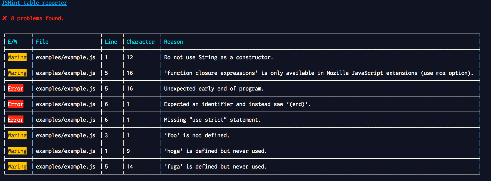

# [JSHint Table Reporter](https://github.com/makotot/jshint-table-reporter)

JSHint Table Reporter is a JSHint reporter displayed in table format.

# Screenshot

### Porblems found.


### No problems found.


## Install

```sh
$ npm install jshint-table-reporter
```

## Usage

```sh
$ jshint --reporter node_modules/jshint-table-reporter/ <target file>.js
```

you can use it also with grunt-contrib-jshint.

```js
jshint: {
  options: {
    reporter: require('jshint-table-reporter')
  }
}
```

## License
©makotot  
Licensed under the MIT license.
